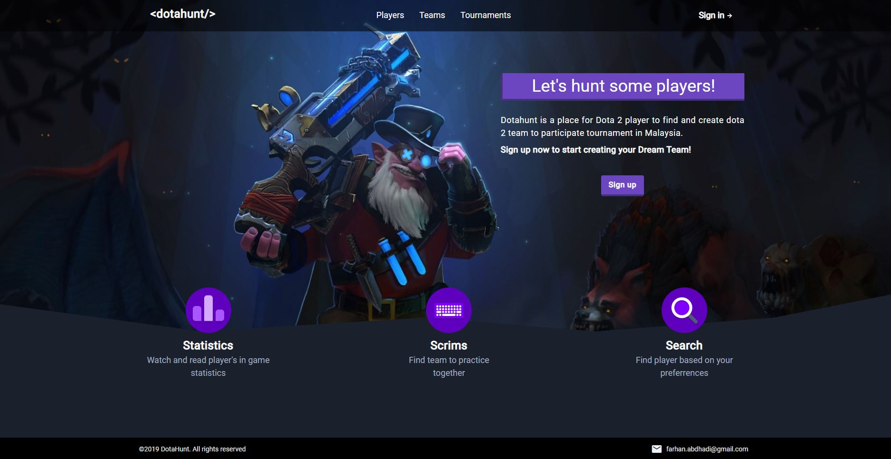
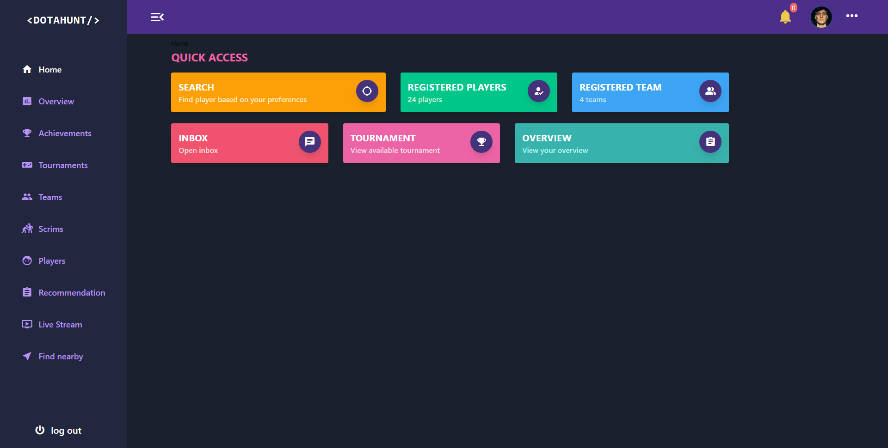
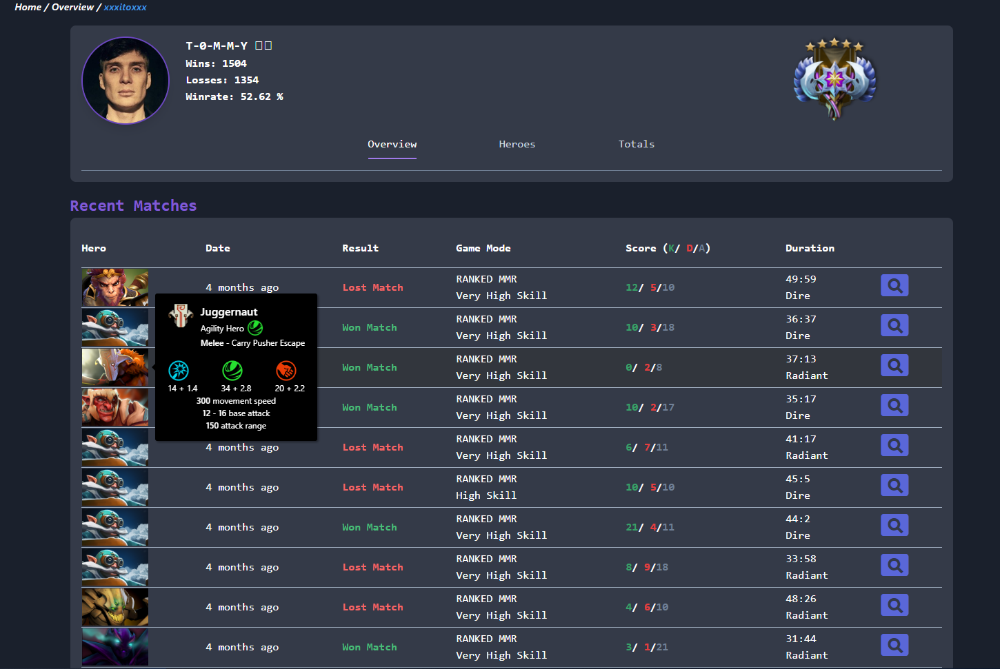

__Alhamdullilah__, saya sedikit pun tak sangka yang saya layak untuk menerima Anugerah ni.
Kalau dibandingkan dengan projek rakan-rakan lain, semua lagi complex dan gempak dari projek yang saya buat.

Basically, projek Dotahunt ni dihasilkan untuk membantu pemain Dota 2 di Malaysia untuk mencari pemain Dota 2 yang lain untuk hasilkan 
pasukan Dota 2 yang berkaliber untuk bertanding di pertandingan Dota 2 yang dianjurkan di seluruh Malaysia.

Kebanyakkan pemain yang bertanding, terdiri 
dari pasukan yang tak cukup handal dan ada juga pasukan yang tidak cukup ahli mengajak kawan diorang yang tak hebat untuk masuk bertanding 
semata-mata nak cukupkan ahli kumpulan. 

__Dotahunt__ cuba untuk membantu pemain Dota 2 mencari pemain ikot kemahuan dan cita rasa pencari, berdasarkan statistik in-game yang diperoleh 
daripada [OpenDota API](https://docs.opendota.com).

STACK yang saya gunakan untuk develop projek ini ialah:
- [Laravel](https://laravel.com) - Backend
- [Vue.js](https://vuejs.org) - Frontend
- [TailwindCSS](https://tailwindcss.com) - Frontend CSS
- [MySQL](https://www.mysql.com) - Database

Untuk sesiapa yang hendak belajar develop application mengunakan Laravel Framework, saya cadangkan 
anda untuk mengikuti [Tutorial Laravel From Scratch daripada Laracast](https://laracasts.com/series/laravel-6-from-scratch).
Jeffrey Way punya pengajaran amat senang untuk difahami dan diikuti.

Untuk lihat lebih lanjut mengenai features Dotahunt, boleh tonton video dibawah.
<iframe src="https://player.vimeo.com/video/412332132" width="940" height="680" frameborder="0" allow="autoplay; fullscreen" allowfullscreen></iframe>

