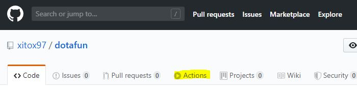
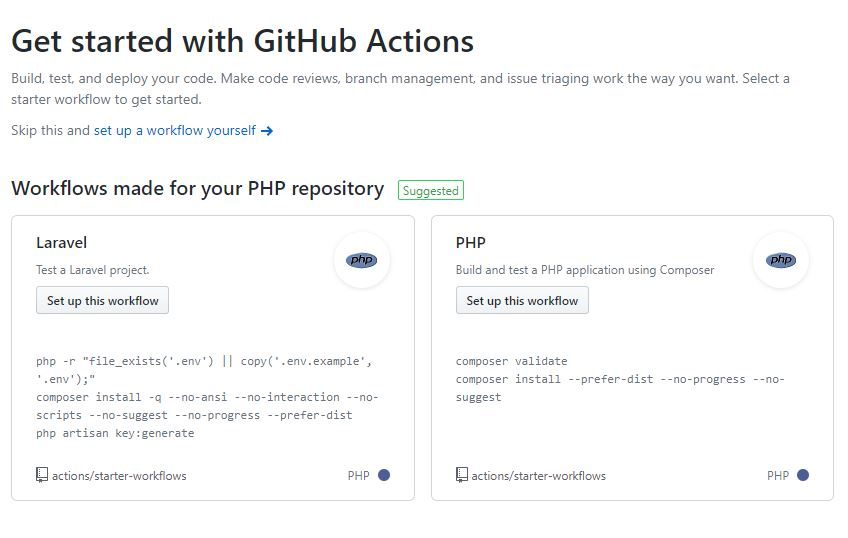
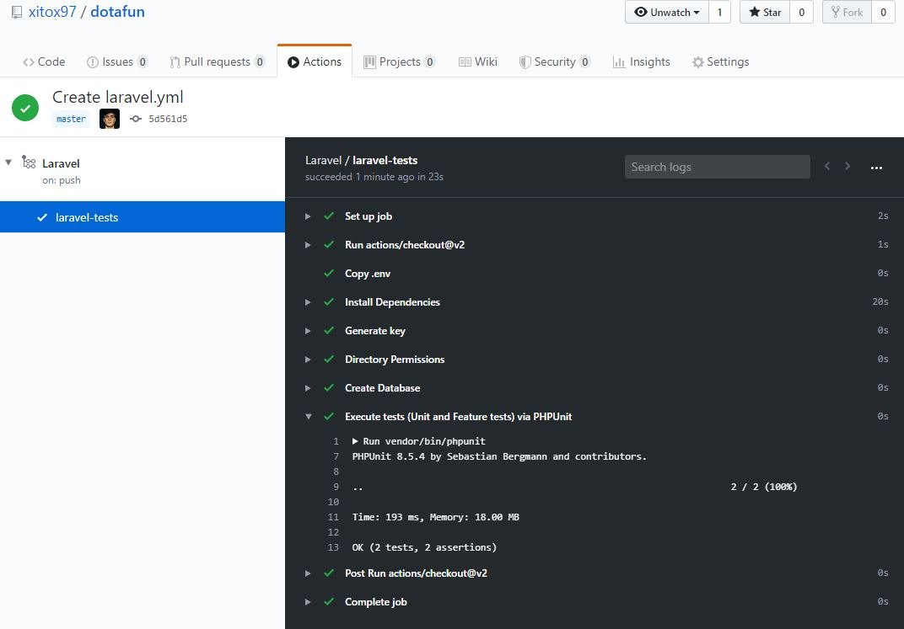
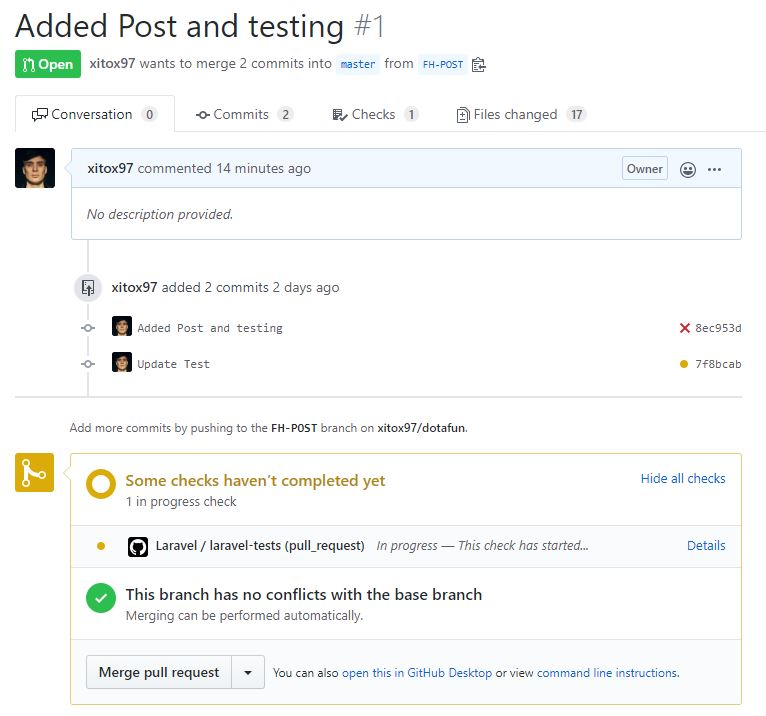
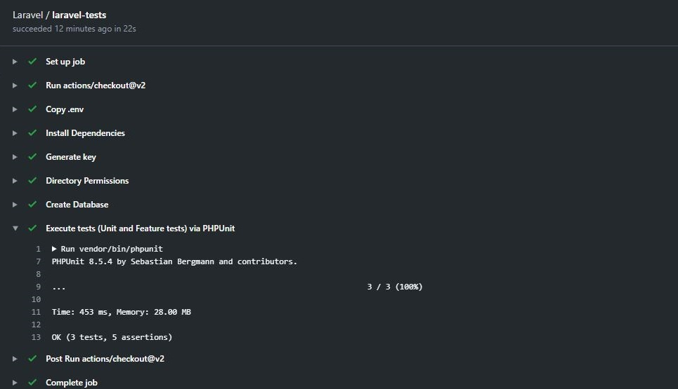
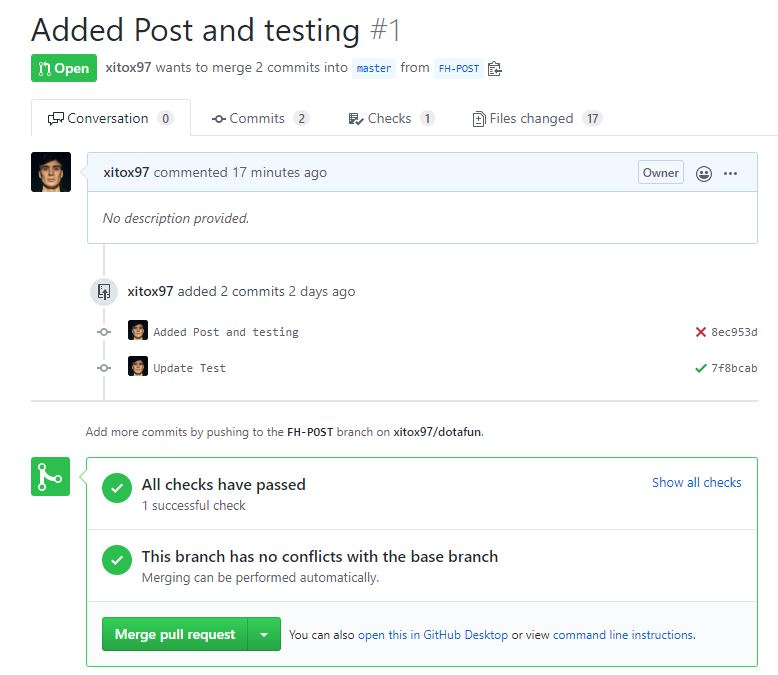

#### GitHub Actions
__GitHub Actions__ ialah servis daripada GitHub untuk melakukan sesuatu aliran kerja dengan secara automatik ke atas _event_ yang telah
dinyatakan.

Sebagai contoh, apabila kita membuat _pull request_ kepada _branch master_. Ia akan _triggered_ GitHub Action yang telah 
di _setup_ untuk menjalankan apa-apa kerja seperti _Testing_. Antara kebaikkanya ialah: 
- Dapat kesan _bug_ lebih awal, oleh kerana sebelum kita _pull request_ kita boleh tahu result test.
- Jimat masa. _Developer_ tidak perlu manually _test the code_.

Untuk fahami lebih lanjut mengenai GitHub Actions, boleh layari 
[blog ini.](https://github.blog/2019-08-08-github-actions-now-supports-ci-cd/)

#### GitHub Actions + Laravel Testing
Jadi, macam mana kita nak integrate GitHub Actions dengan Laravel Project kita?

Keperluan:
- Laravel Project
- GitHub Repository
- mempunyai tests untuk di jalankan

##### Langkah 1 - GitHub Actions


Buka Repository anda dan click __Actions__ tab. Di actions page, akan listkan pelbagai _workflow_, anda perlu mencari 
_workflow_ Laravel, dan click __Set up this workflow__.



##### Langkah 2 - Setup Workflow

GitHub akan membuka page baharu dan _generate code_ untuk Laravel _workflow_.

```yaml
on:
  push:
    branches: [ master ]
  pull_request:
    branches: [ master ]
```

Code atas ini untuk kita kasi tahu GitHub Actions, untuk jalankan kerja apabila ada _push event_ 
dan _pull request event_ ke branch master. Anda juga boleh tambah sebanyak mana branch yang anda mahu GitHub Actions dijalankan.

```yaml
runs-on: ubuntu-latest
```

Di __runs-on__ anda boleh nyatakan Operating System apa yang anda nak test ini run. Kalau nak guna windows boleh tambah __windows-latest__.
Code seterusnya macam biasa kita selalu gunakan untuk _setup Laravel project_, dan run PHPunit. 

Kita boleh terus commit tanpa ubah apa-apa. Selepas sahaja kita commit, kita boleh buka balik __actions tab__  di repository kita
dan kita boleh lihat __laravel-tests__ sedang _run_. Test ini telah _run_ sebab kita _commit new changes and push to master branch_.



##### Langkah 3 - Pull Request ke Master branch



Selepas sahaja kita _create pull request_ kepada master, kita dapat lihat __laravel-tests__ _in progress_. Kita boleh click details
untuk lihat lebih lanjut progress testing kita. Boleh lihat diatas, first test saya _failed_ di mana ia menunjuk symbol pangkah.
Saya perlu fix balik code saya dan push balik. Selepas ia berjaya, kita boleh terus _merge pull request_ tanpa rasa ragu-ragu. Mudahkan?



Semoga artikel ini dapat membantu anda untuk setup Laravel Test menggunakan GitHub Action dengan cara paling mudah. Untuk belajar lebih 
_advance_ mengenai GitHub Actions, seperti menggunakan MySQL atau menggunakan pelbagai Laravel version boleh rujuk [artikel ini.](https://freek.dev/1546-using-github-actions-to-run-the-tests-of-laravel-projects-and-packages)

_Sebarang pertanyaan boleh dm saya di Twitter [@MuhdFrhan](https://twitter.com/MuhdFrhan)_

